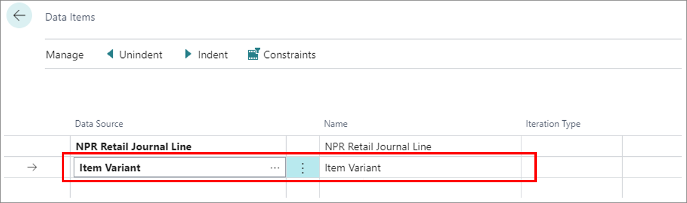
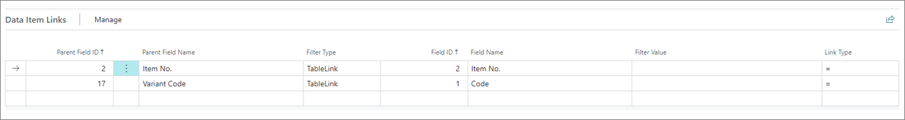
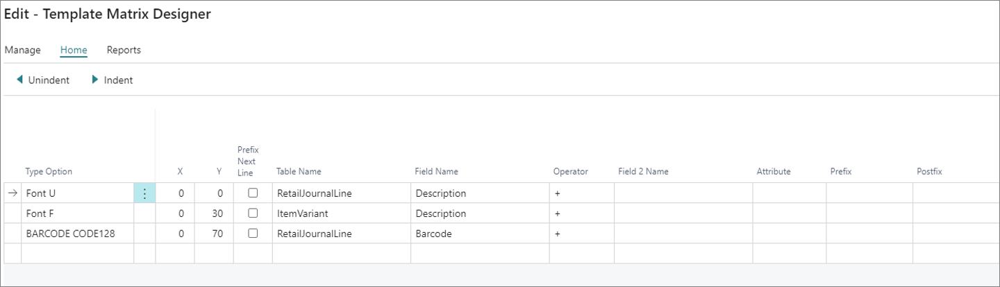
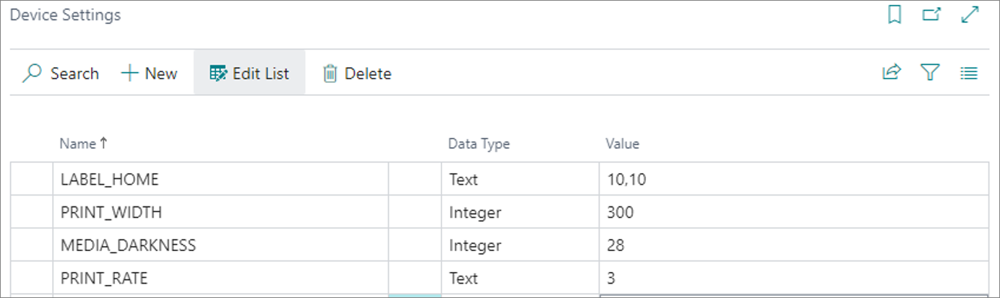

Price labels can be printed in various shapes, sizes and materials to suit the targeted product best. It is for this reason that you may want to create custom price label templates for your business. 

  

1. Click the  button, enter **Print Template List**, and open the related link.    
   On fresh installation, an empty template list is displayed.
2. Click **New** to open an empty **Template Card**.
3. Provide a unique name for the template in the **Code** field.       
   For the purposes of this example, the code is **DEMO_PRICE_LABEL**.
4. Select **Matrix** in the **Printer Type** field.      
   The **Matrix Settings** panel is displayed below.     
   Matrix and line printing is described in more detail in the [<ins>Printer properties<ins>]() article.
5. Make sure that **Zebra** is selected as the **Matrix Device** in the **Matrix Settings** panel.    
   You've now created the most basic price label print template. However, it's recommended to also define which tables will be data sources for the template. 
6. Click **Edit Data Items**.     
   The **Data Items** page provides an overview of all available data items, their relations, and constraints.      

   When printing price labels, item data is transferred to a common table called **NPR Retail Journal Line** which serves as the initial data source. Any additional data sources need to be referenced as subsets of this one. **NP Retail Journal Line** contains fields like **Item No.**, **Description**, **Variant Code**, **Base Unit of Measure**, **Unit Price**, and **Barcode**.

   In this example, the label should contain a **Description**, **Variant Description**, **Unit Price**, and **Barcode**, so the **NPR Retail Journal Line** contains all of the necessary information except for the **Variant Description**.

7. Add a line below **NPR Retail Journal Line**, and select the **Item Variant** data source.

   

8. Set the **Iteration Type** for the **Item Variant** to **First**.       
   As a reference, you can choose between the following iteration types:    

| Option Name      | Description |
| ----------- | ----------- |
| **\<blank>** | No restrictions will be placed on iterations; all records will be included in the iteration. |
| **First** | The first available record will be selected. |
| **Last** | The last available record will be selected. |
| **Total** | You need to select the fields that should be totaled if you use this option. It works as a summation of the selected fields. | 
| **Distinct Values** | This option is typically used only for the **Line Print**, when it's necessary to print all unique/distinct values. |
| **Field Value** | Used when the number of iterations is determined by a field value (integer). |

9.  To link two data sources, and make **Item Variant** a subset of the **NPR Retail Journal Line**, select the row with the **Item Variant**, and trigger the **Indent** action at the top of the page.     
   
   

   It's also necessary to set data item links for the item variant in the **Data Item Links** panel at the bottom of the page. 

   There are two filter types in the **Data Item Links**:

   - **TableLink** - compares a field from the parent data source with a field from the current data source 
   - **Fixed Filter** - uses a user-defined **Filter Value** to a field value from the current data source

10. Establish a link between the **Item No.** and the **Variant Code** in the **NPR Retail Journal Line**, and the **Item No.** and **Code** in the **Item Variant**.

   

11. Navigate back to the **Template Card**, and click **Edit Layout**.      
    The **Template Matrix Designer** is displayed.      
    As the **Printer Type** is set to **Matrix**, the fields for the **X** and **Y** coordinates are displayed.    
    The available **Type Options** correspond to the selected Matrix device, which is Zebra in this example.

    

   This is the visual representation of the layout, taking into account the previously performed setup: 

  

   Therefore, the first line in the layout design needs to be placed in the top left corner. The X and Y coordinates are relative to the previously defined **LABEL_HOME**, so if the first line is placed at 0,0, the final position will be 10,10 due to this setting. 

12. For **Type Option** select **Font U**.

    

13. Open the lookup in the **Table Name**, and select **RetailJournalLine**.    
    The available options will be the data sources defined earlier in the setup.
14. Open the lookup dialog box for the **Field Name**, and select **Description**.     
    This is everything you need to do in order to display the first line of our example. However, other lines can also be set up to match the configuration displayed in the following screenshot: 

    

15. After you're finished with specifying the layout, click **Edit Device Settings**.   
    As with the layout, the selections under the **Printer Type** and **Matrix Device** determine the available options.     
    Typically, **LABEL_HOME**, **PRINT_WIDTH**, **MEDIA_DARKNESS**, and **PRINT_RATE** are set up to ensure correct calibration and good performance. 

    

    In this example, **LABEL_HOME** is set to **10,10** to add a small margin from the corner of the label. The other settings may require some tweaking, since they are dependant on the hardware and media specifications. **PRINT_WIDTH** in this example depends on the DPI, as the value is measured in dots. **PRINT_RATE** is set to **3**, which is the default print rate. **MEDIA_DARKNESS** in this example is set to **28**.