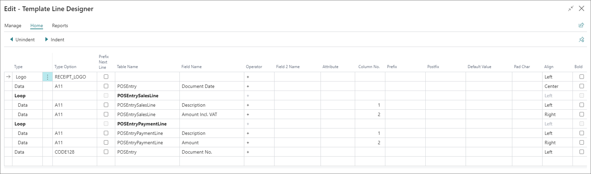

Through this example, you will learn how to create a simple print template for a receipt.

  

## Create a basic receipt print template

1. Click the  button, enter **Print Template List**, and open the related link.    
2. Click **New**.   
   An empty **Template Card** is displayed.
3. Provide a unique name for the template in the **Code** field.       
   For the purposes of this example, the code is **DEMO_RECEIPT**.
4. Select **Line** in the **Printer Type** field.      
   The **Line Settings** panel is displayed below. It is used to determine which printer interface will be targeted.      
   Matrix and line printing are described in more detail in the [<ins>Printer properties<ins>]() article.
5. Make sure **Epson** is selected as the **Line Device**.      
   You've now created the most basic receipt print template. However, it's recommended to also define which tables will be data sources for the template. 

## Add and link data sources

1. Once all general settings are set, click **Edit Data Items** in the **Template Card**.    
   The **Data Items** page provides an overview of all available data items, their relations, and constraints.   
2. Add the **NPR POS Entry** table as the main data source.    

   

3. Add two new lines below **NPR POS Entry**. The first one should be the **NPR POS Entry Sales Line**, and the second one **NPR POS Entry Payment Line**.        

      

4. Select the two newly created lines, and use the **Indent** action at the top of the page, to make them subsets of the **NPR POS Entry**. 
5. Establish the data link between the **NPR POS Entry** and the **NPR POS Entry Sales Line**, and then with the **NPR POS Entry Payment Line**, respectively.          

   They need to be linked with the **NPR POS Entry** through the common **POS Entry No.**, so that only the relevant entries are selected. If the data link isn't set, the data from other POS entries will be included in the data set.      

   For the **NPR POS Entry Sales Line**, the generic **TableLink** will be **Entry No.** in the **NPR POS Entry**, and the **POS Entry No.** in the **NPR POS Entry Sales Line**. An example of a **Fixed Filter** can be placed on the field **Type** from the **NPR POS Entry Sales Line**.      

  

## Set up Template Line Designer

Once the data items are set, use the **Edit Layout** action in the **Template Card** page.     
As the **Printer Type** is set to **Line**, the **Type** and **Column No.** fields are displayed instead of coordinates used for Matrix printing.      
   
The **Type** is used for more advanced line construction and commands: 

| Option Name      | Description |
| ----------- | ----------- |
| **Data** | Predefined printer fonts or barcodes. |
| **Loop** | A repetitive data block. |
| **Command** | Predefined printer commands like **Papercut**, **Open Cash Drawer**, etc. |
| **Logo** | A logo selected in the **Retail Logo Setup** page to be printed. | 
| **Field Caption** | A field caption for a defined field name, used instead of the value. |
| **If Data Found** | Conditional layout, e.g., adding a copy number if this isn't the first print. |

The **Type Option** is populated with options for the **Line Device**, which is set to **Epson**. 

Here's the example of the produced layout and its contents:

1. A single logo in the top, followed by the document date
2. A loop running through each **POSEntrySalesLine**, and outputting two columns for each record
3. A loop running through each **POSEntryPaymentLine**, and outputting two columns for each record
4. A barcode of the **Document No.**

After you've finished setting up the template, move on to device configuration described in the following section.

## Configure Device Settings

1. Click **Edit Device Settings**.    
   As with the layout, the **Printer Type** and the **Line Device** determine the available options in this section.      
   
   For **Epson**, the following settings are available:
   - **MEDIA_WIDTH** - we support the two standards (58mm and 80mm)
   - **ENCODING** - this option is available if a specific encoding is required
   - **DPI** - the print resolution is determined with this option

  

  #### See also 

- [<ins>Printer troubleshooting<ins>]()
- [<ins>Printing overview<ins>]()
- [<ins>Print properties<ins>]()