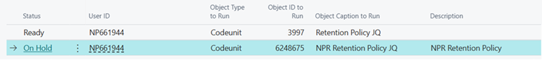
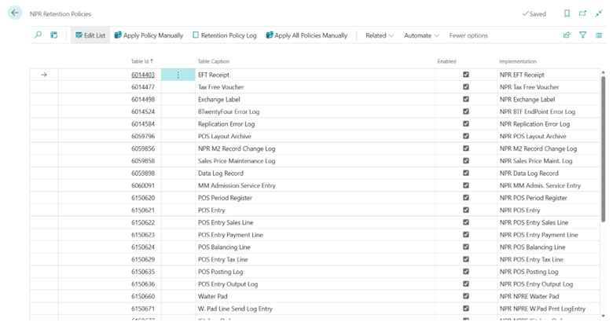
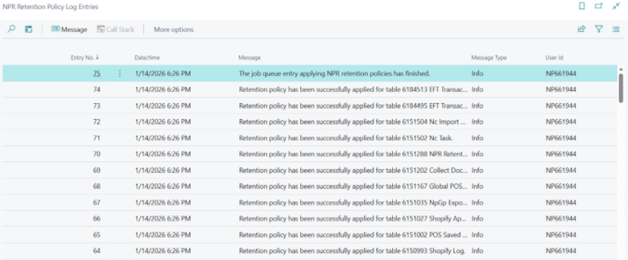

This feature introduces a new retention policy specifically for NaviPartner (NPR) tables. Previously, retention for these tables was handled using the standard functionality. To improve processing speed, our tables now have a dedicated implementation.

As a result, customers will see an additional **Job Queue Entry** for NPR retention policy processing, alongside the standard entry.

- 

## NPR Retention Policies Page 

A new **NPR Retention Policies Page** allows customers to view and disable retention for NPR tables and apply the retention policy manually via a page action if needed.

 

 - 

## NPR Retention Policy Log Entries Page 

The **NPR Retention Policy Log Entries Page** lets customers view when retention policies were applied and also check for any errors that occurred during processing.

The new retention policies use the same logic and filtering as the default NPR retention policies.

Old setup for NPR tables in the standard retention policy is cleared automatically.

#### See also

- [<ins>Create a retention policy<ins>]()