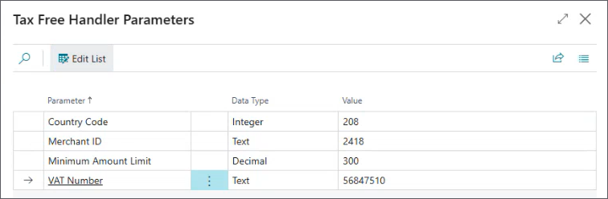

Integration with Planet tax-free offers several benefits, such as simplification of complex tax-free shopping for eligible customers thanks to automated VAT refunds and reduced number of manual errors. 

To use Planet tax-free solution, you need to create the corresponding tax-free profile in Business Central, and attach it to a POS unit. 

If you require more precise instructions, follow the provided steps: 

1. Click the  button, enter **POS Tax Free Profiles** and select the related link.               
   The page which contains all POS tax free profiles created in the environment is displayed. Here, you can link the tax free parameters to each available POS unit.
2. Click **New** and define [<ins>all necessary options<ins>]().   
   The **Code** field is mandatory. 
3. In the **Handler ID** field, select the **PREMIER_PI** for the Planet integrated solution.    
   As soon as you specify the handler ID, you need to set the accompanying parameters. The following parameters should be used for production environments:

  

4. Click **Set Parameters** in the ribbon.     
   Populate the [<ins>parameter-related fields<ins>]().       

  

5. Choose between **PROD** or **TEST** to determine whether the integration will be established on the production environment, or not.         
   The **PROD** option should be selected for customers. 
6. Click the  button, enter **POS Unit List** and select the related link.               
7. Open the POS Unit Card associated with the POS unit you will use for the tax-free integration, and attach the profile you've created to it by selecting it from the **POS Tax Free Profile** dropdown list.
8. 

<!--    sta treba da proveri anita:

   - parametri za premier pi handler - za testiranje (mansa joj je poslao za testiranje)
   - kako se zove akcija koja se kaci na POS da bi radila integracija (nema premier u nazivu izgleda, ili barem ja ne mogu da je nadjem na listi postojecih akcija; postoji neka generalna TAX_FREE akcija, ali nisam sigurna da je to to)
   - printing - da li se referencira neki codeunit ili template? da li ce se samo inicirati stampanje kada krenu prvi put da stampaju voucher? (da li je proverila sa klaudijem da li je to slucaj)
   - nije defiinisan bio codeunit i moguce da fali u setupu.
   - Mihails je isto radio na refaktorisanju ovog feature-a. -->

