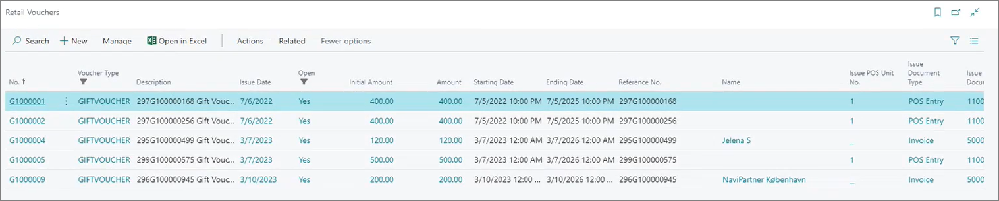
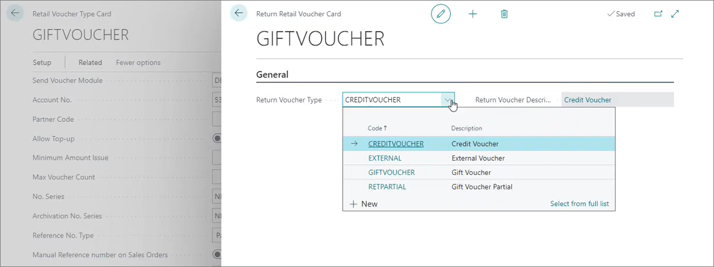
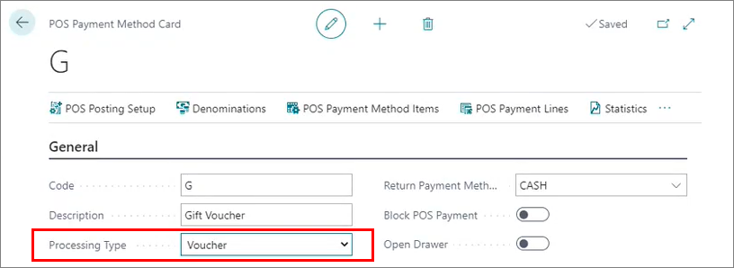

Retail vouchers function as an independent payment method, allowing customers to purchase goods and services using them. Retailers typically provide various types of vouchers, with gift vouchers and credit vouchers being the most common. Voucher types are managed using the **Retail Voucher Type Card**, which is organized into five key sections:

### General      

  This section defines the basic details of a voucher type:     

  - **Code** and **Description** for identification.
  - An overview of the total number of vouchers categorized as open, closed, or archived.      

    By clicking the numbers next to the voucher categorization fields, you can open the list of the corresponding vouchers. 

    

    

### Send Voucher      

Here, you configure rules for issuing vouchers:

  - **Account No.** specifies the number of the account used for posting the sale of vouchers.       
    When a customer purchases a voucher in a store, that sale will be posted under this account number. 
  - **Partner Code** is used in relation to the global voucher validation method. It allows you to establish a connection between multiple companies in an environment.       
  Validation methods are discussed in more detail in the section describing the **Validate Vouchers** FastTab.
  - **Allow Top-up** lets you increase the value of a voucher after the initial purchase by the amount provided by the customer.      
    If you wish to use this option, you also need to create a POS button which will be used to trigger the top-up.
  - **Minimum Amount Issue** specifies the minimum amount that needs to be paid for the voucher to be issued.
  - **Max Voucher Count** specifies the maximum number of vouchers of this type that can be issued.
  - **Manual Reference number on Sales Orders** allows you to assign a reference number you wish on a voucher when you create the voucher form a sales order.
  - **Reference Number** specifies the account number for tracking voucher sales.
  - **Send Method via POS** specifies the manner in which vouchers are delivered to customers:     
    - **Printer** - vouchers are printed
    - **Email** - vouchers are sent to the provided email
    - **SMS** - vouchers are sent to the provided phone number      
    The adequate template or code unit needs to be provided in relation to any of the listed delivery methods. 

### Setup Voucher     

  This section outlines the core settings for voucher functionality:

  - **Voucher Amount** predefines a fixed value for all vouchers of this type.
  - **POS Store Group** limit voucher usage to specific stores or store groups.
  - **Validity Period** defines start and end dates for voucher usage.

### Validate Voucher     

The following validation methods are available:

- **DEFAULT** - refers to the regular voucher validation method.

- **GLOBAL** - refers to scenarios in which multiple companies exist in a single environment, and you wish to be able to use vouchers in all of them. If you choose this method, you also need to populate the **Partner Code** field from the **Send Voucher** FastTab.

You can also make the vouchers valid only for the customer who purchased the voucher if you enable the **Voucher Customer No.** toggle switch. When a customer tries to use the voucher, the system will check whether their customer number corresponds to the customer number tied to the initial voucher purchase. 

If the voucher has a validity period, it is configured here. When used for payment, the system will verify its expiration date to ensure validity.

### Apply Payment      

This section manages rules for redeeming vouchers, offering three options:

  - **Default Redemption**      
    - The voucher is fully redeemed in a single transaction. 
    - If a customer uses a voucher to purchase goods with lower amount than the amount on the voucher, the initial voucher is archived, and a new voucher is created for the remaining amount.       
   
    You can determine which return voucher type is created for the remaining amount with the **Setup Apply Payment** option in the **Retail Voucher Type Card** ribbon.     

  

  - **Partial Redemption**       
    - Allows partial use of the voucher. 
    - If a customer uses a voucher to purchase goods with lower amount than the amount on the voucher, the remaining balance can be saved for future use on the same voucher (the voucher will not be archived).

  - **Limited Redemption**
    - If a customer attempts to use a voucher to purchase goods with lower amount than the amount on the voucher, the customer will be prevented from using the voucher altogether.

You can also set the POS payment method in this section. Any payment method you specify here needs to have **Voucher** set as its **Processing Type**.

  

<iframe width="560" height="315" src="https://www.youtube.com/embed/ZPpyT5wZDhc" title="YouTube video player" frameborder="0" allow="accelerometer; autoplay; clipboard-write; encrypted-media; gyroscope; picture-in-picture; web-share" allowfullscreen></iframe>

#### See also

- [<ins>Discount types<ins>]()
- [<ins>Create a new voucher<ins>]()