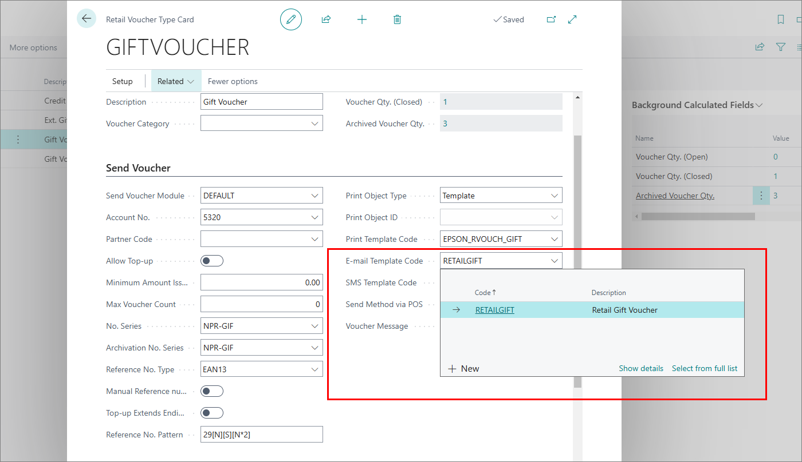
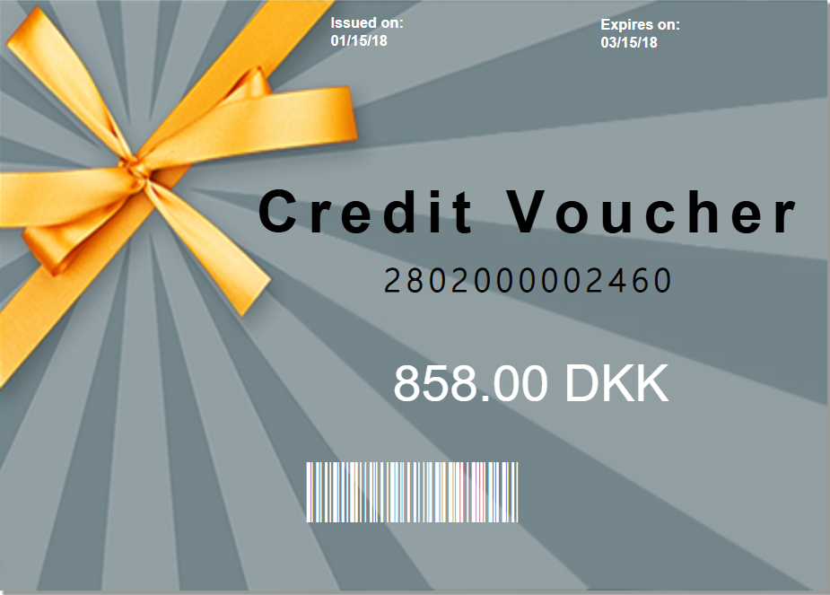

Email templates serve as an integral component of modern e-commerce systems, particularly in delivering vouchers purchased from web stores.

Templates eliminate the need for manual email drafting for each transaction. Additionally, predefined placeholders within templates allow dynamic insertion of customer-specific data, such as names, voucher codes, and purchase details.

Follow the provided steps to set e-mail body that recipients of the voucher will receive.

1. Follow the guide on [<ins>setting up email templates<ins>](), while applying the following changes:
   - Make sure to add the **6151013** table to the **Table No.** field, as it contains the necessary information regarding vouchers
   - Provide the **Report ID** either of a built-in report (**6151013**) or a [<ins>custom one<ins>]().      

2. Click the  button, enter **Retail Voucher Types**, and choose the related link.
3. Select the voucher type that will be used for web vouchers and open its card.
4. Select the e-mail template that will be used for sending vouchers to recipients.

  

## Create a voucher report layout in Business Central

You can use built-in reports to build the email layout, it is also possible to create your own that caters to specific business needs.

Follow the provided steps to create a custom report layout:

1. Click the  button, enter **Report Layout Selection**, and choose the related link.
2. Use the search function to find the **6151013** layout. 
3. Click **Custom Layouts** in the ribbon.        
    The **Custom Report Layouts** pop-up window is displayed.
4. Click **New**.     
   You are presented with a choice to either create an entirely new layout or copy from an existing one.
5. Click **New...**.
6. Select if you want to create a **Word layout**, **RDLC layout**, or both, and then click **OK**.      
   Once you create a custom layout, you can export it and add some changes to it. Later you can import it again. 

  

7. To preview the custom layout, click **Home** > **Run Report** in the ribbon, and then **Preview** in the pop-up window. 

  

8. Click the  button, enter **Magento Setup**, and choose the related link.      
   The **Magento Setup** window is displayed.
9. Scroll down to the **Order Import** FastTab, and activate the **Post Retail Vouchers on Import** toggle switch if you wish the sales order lines to be posted for new retail vouchers on import automatically.       

#### Next steps

- [<ins>Set up gift vouchers in Magento Webadmin<ins>]()
