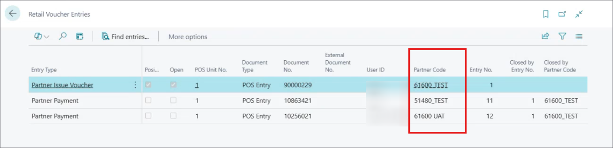

Global vouchers are issued by multiple companies within the same database, and can be redeemed at any company in that tenant or other tenants. The managing company stores data for all issued vouchers, while each subsidiary company tracks its own transactions involving vouchers. During setup, you must clearly define the roles of the managing company and the subsidiary companies.

Follow the steps below to configure global vouchers in the managing company and subsidiary company environments.

## Managing Company Setup

1. Click the  button, enter **Retail Voucher Types**, and choose the related link.     
    A list of all existing **Retail Vouchers** is displayed.
2. Click **New** and populate the [<ins>available fields and options<ins>]() in the **Retail Voucher Card**.    
3. Make sure that you provide the **Partner Code**.    
  The partner code ensures all voucher transaction details, such as issuing and redeeming stores and remaining balances, are sent to the managing company.

  

4. (Optional) If there's no partner code in the system, create one, and provide the **Code** and **Description**.   
   It's not necessary to define any additional parameters on the managing company environment, since no voucher data needs to be sent from the managing company to the subsidiaries.
5. Set **Validate Voucher Module** to **DEFAULT**.    
   After completing these steps, proceed to set up subsidiary company environments.

## Subsidiary Company Setup

1. Click the  button, enter **Retail Voucher Types**, and choose the related link.     
   A list of all existing **Retail Vouchers** is displayed.
2. Click **New** and populate the [<ins>available fields and options<ins>]() in the **Retail Voucher Card**.     
   The voucher type needs to be the same as the one created in the managing company environment.
3. Make sure that you provide the **Partner Code** for each subsidiary company you set up.     
   Each subsidiary company has to have its own distinct partner code.
4. Assign a unique Partner Code for each subsidiary company. Provide the **Code**, **Name**, and configure its parameters.      
   The **Service Url** to the web service with which the managing company collects voucher-related data from the subsidiaries is automatically populated when the subsidiary company name is provided (if the subsidiary and the managing company share a tenant).
1. Select **OAuth 2.0** under **Auth. Type**.   
   Older Business Central versions may support **Basic Authentication**, but **OAuth 2.0** is required for BC SaaS.
2. Provide the **OAuth2.0 Setup Code**.     
   Use authentication credentials specific to the subsidiary company.
3. Set **Validate Voucher Module** to **GLOBAL**.     
   In this way, you're ensuring that the voucher-related data is synced back to the managing company.
4. In the ribbon, click **Setup**, followed by the **Setup Validate Voucher** action.    
   The **Global Voucher Setup** pop-up window is displayed.
5.  Provide the name of the managing company in **Service Company Name**.     
    The **Service Url** is automatically populated. 

    

6.  Check the validity of your setup via the **Validate Global Voucher Setup** action in the ribbon.

This setup ensures seamless synchronization of voucher data between the managing company and its subsidiaries, reducing manual effort and maintaining accurate records.