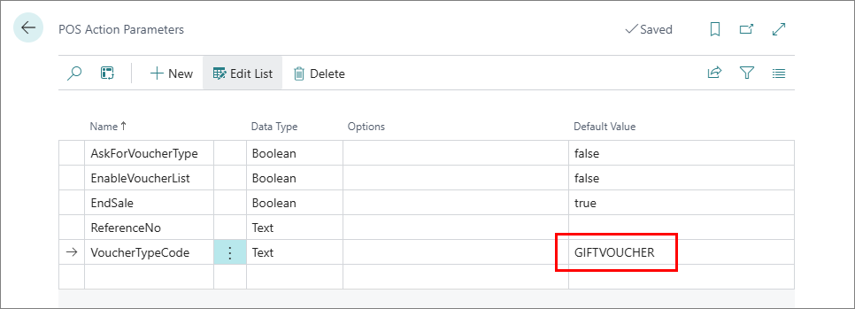
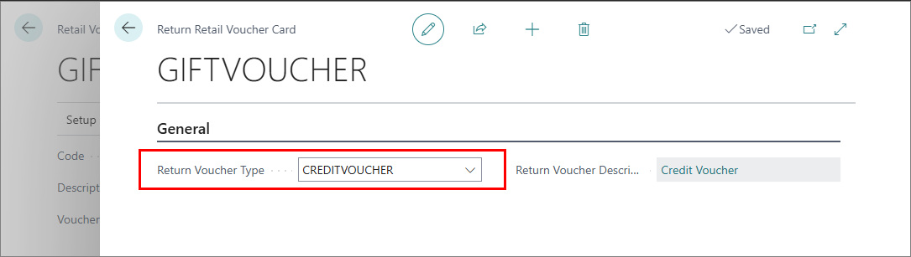

Retail vouchers are a payment type that can be scanned in stores which issued them to purchase various goods and services. This process of purchasing goods and services with vouchers is also referred to as the voucher redemption/voucher redeeming process.

To issue gift vouchers, make sure the prerequisites are met, and follow the provided steps:

#### Prerequisites in Business Central

- The **Gift Voucher Retail Voucher Type** needs to be [<ins>defined<ins>]() in the company setup.
- The **Redeem Gift Voucher** button with the [<ins>**SCAN_VOUCHER_2** action<ins>]() needs to be [<ins>added to the POS<ins>]().        
  If a gift voucher is supposed to be redeemed, you can set the **VoucherTypeCode** parameter of this action to **GIFTVOUCHER**. 

  

  You can also reference another voucher type here, or leave the parameter empty, and set **AskForVoucherType** to **True** so that the voucher type can be specified from the POS directly. 

- Make sure that **Voucher** is set as the **Processing Type** in the **Payment Method Card** of the payment method selected for this transaction. 
- Make sure that you've selected the **Return Voucher Type**. In this example, that voucher type is **CREDITVOUCHER**.     
  
  

#### Procedure

1. Open the POS.
2. Select items the customer wishes to purchase.
3. Press **Go to payment**.
4. Press the **Redeem Gift Voucher** button.     
   A pop-up window containing available options for redeeming the voucher is displayed.
5. Press **Scan Retail Gift Voucher – Full Redeem**.      
   A pop-up window prompting you to provide the voucher's reference number is displayed.
6. Input the gift voucher’s reference number in the designated field.
7. Confirm that the remaining amount is going to be issued as a **Credit Voucher**.    
   The sale is now concluded.

